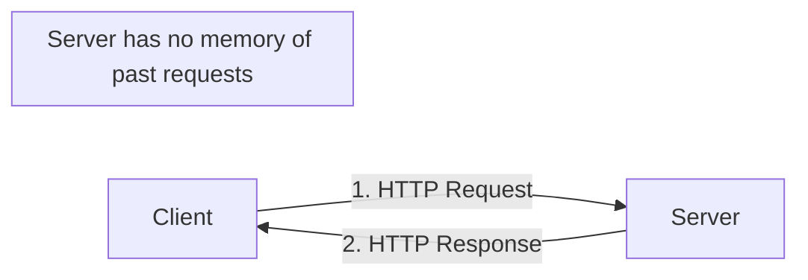
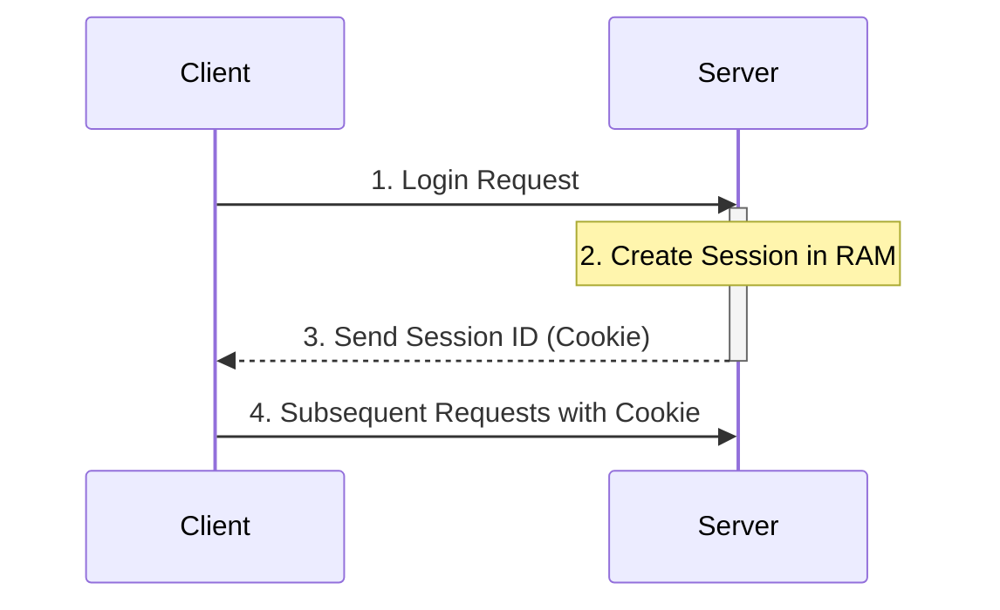
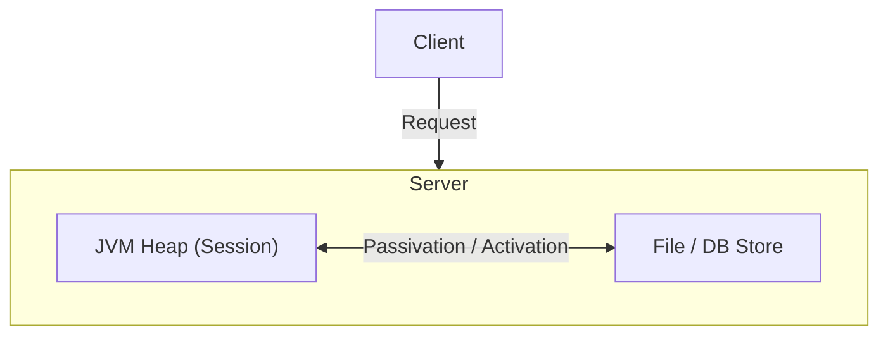
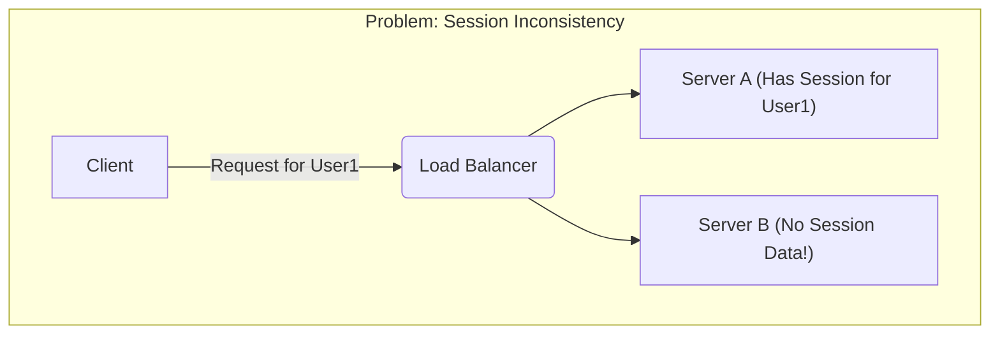
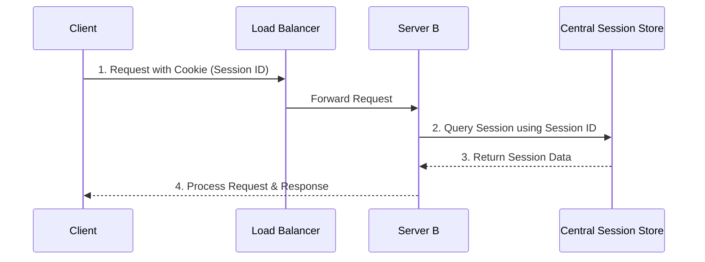
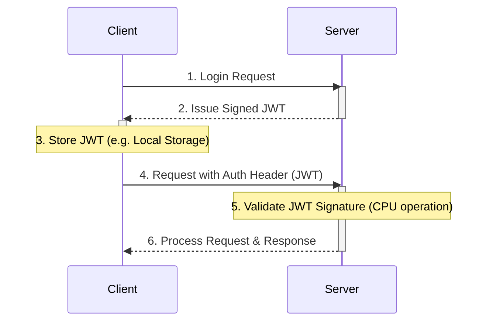

# [ADR-003] 인증 방식 선정: 토큰 기반 인증(JWT)

- **Version:** 1.0.0
- **Status:** Finalized
- **Last Updated:** 2025-10-05

이 문서는 웹의 상태 관리(Session Management) 기술의 발전 과정을 분석하고, LifeLogix 프로젝트가 채택한 인증 방식과 그 기술적 근거를 기록합니다.

---

### **1. A Primer on State: Why Not Just Use the URL?**

웹 통신에는 주로 **GET**과 **POST** 방식이 사용됩니다. GET은 URL에 데이터를 붙여 보내고, POST는 본문(Body)에 담아 보냅니다. 흔히 "개발자 도구로 보면 POST 본문도 다 보이는데, 무슨 보안 차이가 있나?"라고 생각하기 쉽습니다.

이는 절반만 맞는 이야기입니다. POST가 암호화되지는 않지만, **URL에 데이터가 노출될 때 발생하는 심각한 부수 효과(Side Effects)를 막아주는 것이** 핵심입니다.

- **Browser History & Bookmarks:** `?id=test&pw=1234` 같은 민감한 정보가 URL에 담기면 브라우저 기록, 북마크, 자동 완성에 그대로 저장됩니다.
- **Server Logs:** 웹 서버는 요청 URL 전체를 로그 파일에 기록하므로, 관리자나 해커가 로그 파일만 봐도 정보를 탈취할 수 있습니다.
- **Referrer Headers:** 다른 사이트로 이동할 때, 이전 페이지의 URL(민감 정보 포함)이 Referrer 헤더를 통해 제3자에게 유출될 수 있습니다.

이처럼 세션 ID와 같은 민감한 상태 정보는 URL이 아닌, 통제된 방식(쿠키, Body 등)으로 다뤄야만 합니다. 이것이 바로 지금부터 살펴볼 세션 관리 기술의 출발점입니다.

---

### **2. The Foundation: The Stateless Nature of HTTP**

웹의 기본 통신 규약인 **HTTP**는 각 요청이 이전 요청과 전혀 무관한 독립적인 트랜잭션으로 취급되는 **'무상태(Stateless)'** 프로토콜입니다. 이 설계는 웹의 단순성과 확장성을 위한 핵심이었지만, 사용자의 상태를 기억해야 하는 동적인 웹 서비스의 등장으로 보완이 필요해졌습니다.

---

### **3. Solution 1: The In-Memory Session (The Default Approach)**

가장 기본적인 해결책은 서버의 메모리를 활용하는 것입니다. 사용자가 로그인하면, 서버는 고유한 **세션 ID**를 생성하여 쿠키로 클라이언트에게 보내고, 해당 세션 ID와 사용자 정보는 서버의 **RAM (JVM Heap)에** 저장합니다.

- **치명적 약점:** **휘발성(Volatility).** 서버가 재시작되면 RAM의 모든 세션 데이터가 사라집니다.

---

### **4. Solution 2: The Persistent Session (Tomcat's Built-in Store)**

단일 서버 환경의 '휘발성' 문제를 해결하기 위해, 톰캣과 같은 WAS는 세션을 서버의 **파일(File Store)이나** **데이터베이스(DB Store)에** 백업하는 내장 기능을 제공했습니다. 이를 통해 서버가 재시작되어도 세션을 유지할 수 있습니다.

- **치명적 약점:** **성능(Performance).** 디스크에 읽고 쓰는 작업(Disk I/O)은 RAM에 비해 극도로 느려, 고성능을 요구하는 환경에는 부적합합니다.

---

### **5. The Scalability Crisis: Failure in a Multi-Server Environment**

트래픽 분산을 위해 로드 밸런서와 여러 대의 서버를 도입하는 순간, 앞선 두 방식은 한계에 부딪힙니다. 세션 정보가 특정 서버의 RAM이나 디스크에 종속되어 있어, 다른 서버는 해당 정보에 접근할 수 없는 **세션 불일치**가 발생합니다.

---

### **6. Solution 3: The Distributed Session (The Modern Standard)**

이 확장성 문제를 해결하기 위해 모든 서버가 공유하는 **외부 중앙 세션 저장소**를 도입합니다. **Redis**와 같은 고성능 **인메모리(In-Memory)** 데이터 스토어를 사용하여, Solution 2의 성능 저하 없이 Solution 1의 속도와 확장성을 모두 확보합니다.

> Redis 역시 외부 서버이므로 네트워크 커넥션 비용이 발생하지만, 모든 작업이 디스크가 아닌 RAM에서 처리되므로 디스크 I/O 병목이 없어 DB 방식보다 압도적으로 빠릅니다.

---

### **7. An Alternative Evolution: Token-based Authentication (JWT)**

서버가 세션 저장소에 의존하는 것마저 제거하여 **서버를 완벽한 무상태(Truly Stateless)로** 만드는 방식도 있습니다. 바로 **JWT(JSON Web Token)으로** 대표되는 토큰 기반 인증입니다. 마이크로서비스나 모바일/SPA 환경에서 각광받는 방식입니다.

서버는 사용자 정보를 암호화 서명하여 '토큰'으로 발급하고, 클라이언트는 이 토큰을 저장했다가 요청 시마다 헤더에 첨부합니다. 서버는 별도의 저장소 조회 없이 토큰의 서명만 검증하면 되므로 확장성이 극대화됩니다. **다만, 한 번 발급된 토큰은 만료 시점까지 유효하므로 탈취 시 즉각적인 무효화가 어렵다는 단점도 존재하며, 이를 보완하기 위한 전략(e.g., Refresh Token)이 필요합니다.**

> 이때 저장소 조회로 인한 **네트워크/I/O 비용은 발생하지 않지만, 서명을 검증하는 과정에서 약간의 CPU 연산 비용이 발생**합니다. 이 비용은 일반적으로 네트워크 요청 비용에 비해 훨씬 저렴하고 빠릅니다.

---

### **8. At-a-glance Comparison**

| 구분 | 상태 저장 위치 | 주요 장점 | 주요 단점 |
| :--- | :--- | :--- | :--- |
| **In-Memory Session** | 개별 서버 RAM | 매우 빠름 | 휘발성, 확장 불가 |
| **Persistent Session**| 개별 서버 Disk/DB | 서버 재시작 시 유지 | 성능 저하 (Disk I/O) |
| **Distributed Session**| 외부 중앙 저장소(Redis)| 뛰어난 확장성, 빠른 속도 | 인프라 복잡도 증가 |
| **Token-based (JWT)** | 클라이언트 (서버는 무상태)| 최고의 확장성, 유연함 | 토큰 탈취 위험, 강제 만료 어려움 |

---

### **9. 최종 의사결정: LifeLogix의 선택**

**LifeLogix 프로젝트는 인증 방식으로 JWT 기반의 토큰 인증을 채택합니다.**

이는 우리가 수립한 **핵심 선정 원칙(Core Philosophy)에** 가장 부합하는 선택입니다.

1.  **Scalability (확장성):** 서버가 상태를 저장하지 않는 '완전한 무상태(Truly Stateless)' 구조는 향후 마이크로서비스 아키텍처로의 전환이나 트래픽 급증에 따른 서버 증설 시, 세션 불일치 문제로부터 자유로워 압도적인 확장성을 제공합니다.
2.  **Productivity (생산성):** 세션 저장소를 위한 별도의 인프라(Redis 등)를 초기 MVP 단계에서부터 구성할 필요가 없어, 개발 초기 생산성을 높이고 복잡도를 낮춥니다.
3.  **Testability (테스트 용이성):** 각 API 요청이 상태에 의존하지 않고 독립적으로 처리될 수 있으므로, API 단위의 테스트를 작성하고 검증하기에 용이한 구조입니다.

토큰 기반 인증의 단점으로 지적되는 '토큰 탈취' 문제는 HTTPS를 통해 통신을 암호화하고, '강제 만료의 어려움'은 추후 Refresh Token 패턴을 도입하여 보완해 나갈 계획입니다.