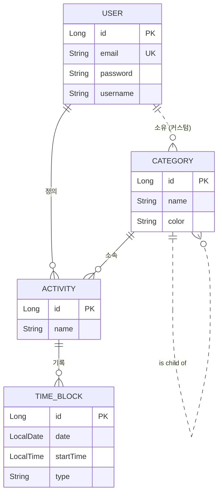

# LifeLogix API Contract: MVP Phase 1 (Core Engine)

- **Version:** 1.2.0
- **Status:** Agreed
- **Last Updated:** 2025-10-08

이 문서는 LifeLogix 프로젝트의 첫 번째 마일스톤인 'Core Engine' MVP 개발을 위한 프론트엔드-백엔드 간의 공식적인 약속을 정의합니다.

## 1. Scope

"단일 사용자가 회원가입/로그인 후, 카테고리와 활동을 관리하고, 특정 날짜의 타임라인에 자신의 활동(Activity)을 30분 단위로 기록하고 조회할 수 있다."

## 2. Domain Model

`USER`는 커스텀 `CATEGORY`를 소유할 수 있으며, 모든 커스텀 `CATEGORY`는 시스템 기본 `CATEGORY`를 부모로 가집니다.



## 3. API Endpoints

**Base Path:** `/api/v1`

### 3.1. Authentication (`/auth`)

#### `POST /auth/register`
- **Description:** 새로운 사용자를 등록합니다.
- **Request Body:**
  ```json
  {
    "email": "test@lifelogix.com",
    "password": "!TestPassword123",
    "username": "tester"
  }
  ```
- **Success Response (201 CREATED):**
  ```json
  {
    "message": "회원가입이 성공적으로 완료되었습니다."
  }
  ```

#### `POST /auth/login`
- **Request Body:**
  ```json
  {
    "email": "test@lifelogix.com",
    "password": "!TestPassword123"
  }
  ```
- **Success Response (200 OK):**
  ```json
  {
    "accessToken": "eyJhbGciOiJIUzI1NiJ9...",
    "tokenType": "Bearer"
  }
  ```

### 3.2. Category (`/categories`)

#### `GET /categories`
- **Description:** 사용 가능한 모든 카테고리 목록을 조회합니다. (시스템 기본 + 사용자 정의) (JWT 인증 필요)
- **Success Response (200 OK):**
  ```json
  [
    { "id": 1, "name": "수면", "color": "#5D6D7E", "isCustom": false, "parentId": null },
    { "id": 7, "name": "학습", "color": "#9B59B6", "isCustom": false, "parentId": null },
    { "id": 13, "name": "사이드 프로젝트", "color": "#E74C3C", "isCustom": true, "parentId": 9 }
  ]
  ```

#### `POST /categories`
- **Description:** 새로운 사용자 정의 카테고리를 생성합니다. (JWT 인증 필요)
- **Request Body:**
  ```json
  {
    "name": "사이드 프로젝트",
    "color": "#E74C3C",
    "parentId": 1
  }
  ```
- **Success Response (201 CREATED):**
  ```json
  {
    "id": 13,
    "name": "사이드 프로젝트",
    "color": "#E74C3C",
    "isCustom": true,
    "parentId": 9
  }
  ```

### 3.3. Activity (`/activities`)

#### `POST /activities`
- **Description:** 특정 카테고리 하위에 새로운 활동을 생성합니다. (JWT 인증 필요)
- **Request Body:**
  ```json
  {
    "name": "LifeLogix 개발",
    "categoryId": 13
  }
  ```
- **Success Response (201 CREATED):**
  ```json
  {
    "id": 1,
    "name": "LifeLogix 개발"
  }
  ```

#### `GET /activities`
- **Description:** 사용자가 정의한 모든 활동 목록을 카테고리별로 그룹화하여 조회합니다. (JWT 인증 필요)
- **Success Response (200 OK):**
  ```json
  [
    {
      "categoryId": 2,
      "categoryName": "식사",
      "activities": [
        { "id": 2, "name": "조식" },
        { "id": 3, "name": "중식" }
      ]
    },
    {
      "categoryId": 13,
      "categoryName": "사이드 프로젝트",
      "activities": [
        { "id": 1, "name": "LifeLogix 개발" }
      ]
    }
  ]
  ```

### 3.4. Timeline (`/timeline`)

#### `POST /timeline/block`
- **Description:** 특정 시간 슬롯에 활동을 기록(생성/수정)합니다. (JWT 인증 필요)
- **Request Body:**
  ```json
  {
    "date": "2025-10-08",
    "startTime": "14:30",
    "type": "ACTUAL",
    "activityId": 1
  }
  ```
- **Success Response (201 CREATED):**
  ```json
  {
    "activityId": 1,
    "activityName": "LifeLogix 개발",
    "categoryName": "사이드 프로젝트",
    "categoryColor": "#E74C3C"
  }
  ```

#### `GET /timeline`
- **Description:** 특정 날짜의 모든 타임 블록 정보를 조회합니다. (JWT 인증 필요)
- **Query Parameter:** `date` (String, `YYYY-MM-DD` format)
- **Success Response (200 OK):**
  ```json
  {
    "date": "2025-10-08",
    "timeBlocks": [
      {
        "startTime": "12:00:00",
        "plan": { "activityId": 3, "activityName": "중식", "categoryName": "식사", "categoryColor": "#F5B041" },
        "actual": null
      },
      {
        "startTime": "14:30:00",
        "plan": null,
        "actual": { "activityId": 1, "activityName": "LifeLogix 개발", "categoryName": "사이드 프로젝트", "categoryColor": "#E74C3C" }
      }
    ]
  }
  ```

---

## 4. Common Error Responses

모든 API는 에러 발생 시 아래와 같은 형식의 응답을 반환합니다.

```json
{
  "timestamp": "2025-10-08T14:30:00.000Z",
  "status": 403,
  "error": "Forbidden",
  "message": "해당 리소스를 사용할 권한이 없습니다.",
  "path": "/api/v1/timeline/block"
}
```

- **400 Bad Request:** 요청 파라미터가 잘못되었거나, 비즈니스 규칙을 위반한 경우. (e.g., 이메일 형식 오류, 잘못된 부모 카테고리 지정)
- **401 Unauthorized:** 유효한 JWT 토큰 없이 보호된 리소스에 접근한 경우.
- **403 Forbidden:** 인증은 되었으나, 다른 사용자의 리소스에 접근하는 등 해당 작업을 수행할 권한이 없는 경우.
- **404 Not Found:** 요청한 리소스가 존재하지 않는 경우. (e.g., 존재하지 않는 categoryId로 활동 생성 시도)
- **409 Conflict:** 리소스가 이미 존재하여 생성할 수 없는 경우. (e.g., 중복된 이메일로 회원가입 시도)