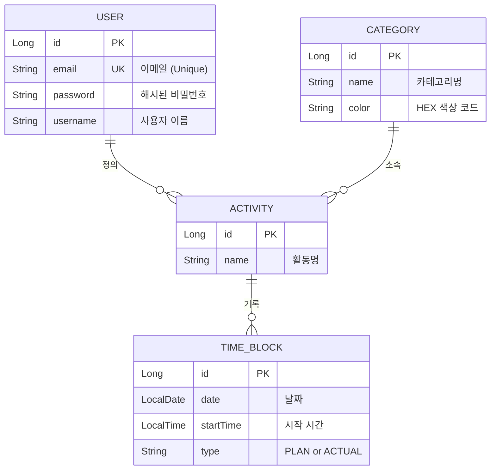

# LifeLogix API Contract: MVP Phase 1 (Core Engine)

- **Version:** 1.0.0
- **Status:** Agreed
- **Last Updated:** 2025-09-27

이 문서는 LifeLogix 프로젝트의 첫 번째 마일스톤인 'Core Engine' MVP 개발을 위한 프론트엔드-백엔드 간의 공식적인 약속을 정의합니다.

## 1. Scope

"단일 사용자가 회원가입/로그인 후, 특정 날짜의 타임라인에 자신의 활동(Activity)을 30분 단위로 기록하고 조회할 수 있다."

## 2. Domain Model



## 3. API Endpoints

**Base Path:** `/api/v1`

### 3.1. Authentication (`/auth`)

#### `POST /register`
- **Description:** 새로운 사용자를 등록합니다.
- **Request Body:**
  ```json
  {
    "email": "test@lifelogix.com",
    "password": "!TestPassword123",
    "username": "tester"
  }
  ```
- **Validation Rules:**
    - `email`: 유효한 이메일 형식이어야 합니다. (중복 불가)
    - `password`: 최소 8자 이상, 영문, 숫자, 특수문자를 포함해야 합니다.
    - `username`: 2~10자 사이여야 합니다. (중복 불가)
- **Success Response (201 CREATED):**
  ```json
  {
    "message": "회원가입이 성공적으로 완료되었습니다."
  }
  ```

#### `POST /login`
- **Request Body:**
  ```json
  {
    "email": "test@lifelogix.com",
    "password": "!TestPassword123"
  }
  ```
- **Success Response (200 OK):**
  ```json
  {
    "accessToken": "eyJhbGciOiJIUzI1NiJ9...",
    "tokenType": "Bearer"
  }
  ```

### 3.2. Timeline (`/timeline`)

#### `GET /timeline`
- **Description:** 특정 날짜의 모든 타임 블록 정보를 조회합니다. (JWT 인증 필요)
- **Query Parameter:** `date` (String, `YYYY-MM-DD` format)
- **Success Response (200 OK):**
  ```json
  {
    "date": "2025-09-27",
    "timeBlocks": [
      {
        "startTime": "09:00",
        "plan": { "activityId": 1, "activityName": "코딩", "categoryName": "자기계발", "categoryColor": "#4A9E2" },
        "actual": { "activityId": 1, "activityName": "코딩", "categoryName": "자기계발", "categoryColor": "#4A9E2" }
      },
      {
        "startTime": "09:30",
        "plan": { "activityId": 1, "activityName": "코딩", "categoryName": "자기계발", "categoryColor": "#4A9E2" },
        "actual": null
      }
    ]
  }
  ```

#### `POST /timeline/block`
- **Description:** 특정 시간 슬롯에 활동을 기록(생성/수정)합니다. (JWT 인증 필요)
- **Request Body:**
  ```json
  {
    "date": "2025-09-27",
    "startTime": "10:00",
    "type": "ACTUAL",
    "activityId": 2
  }
  ```
- **Success Response (201 CREATED):**
  ```json
  {
    "activityId": 2,
    "activityName": "운동",
    "categoryName": "건강",
    "categoryColor": "#50E3C2"
  }
  ```

---

## 4. Common Error Responses

모든 API는 에러 발생 시 아래와 같은 형식의 응답을 반환합니다.

```json
{
  "timestamp": "2025-09-27T10:00:00.000Z",
  "status": 400,
  "error": "Bad Request",
  "message": "요청 본문이 유효하지 않습니다.",
  "path": "/api/v1/register"
}
```

- **400 Bad Request:** 요청 파라미터가 잘못되었거나, 유효성 검사 규칙을 위반한 경우. (e.g., 이메일 형식 오류)
- **401 Unauthorized:** 유효한 JWT 토큰 없이 보호된 리소스에 접근한 경우.
- **404 Not Found:** 요청한 리소스가 존재하지 않는 경우.
- **409 Conflict:** 리소스가 이미 존재하여 생성할 수 없는 경우. (e.g., 중복된 이메일로 회원가입 시도)